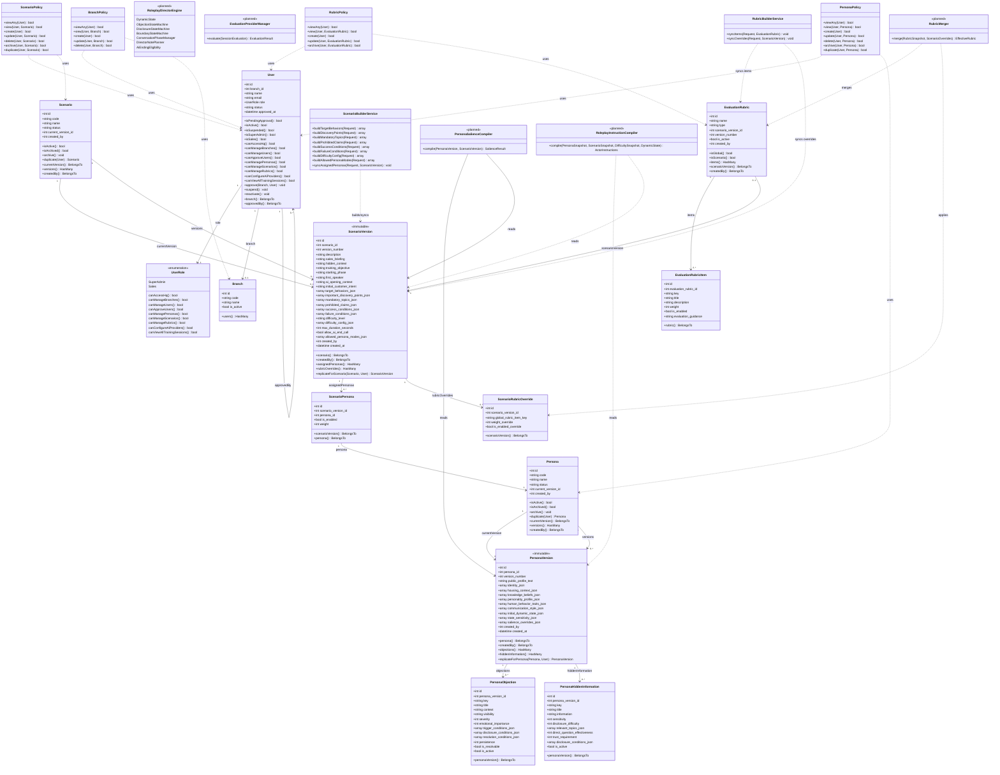

# Domain Model

```mermaid
classDiagram
    class UserRole {
        <<enumeration>>
        SuperAdmin
        Sales
        canAccessHq() bool
        canManageBranches() bool
        canManageUsers() bool
        canApproveUsers() bool
        canManagePersonas() bool
        canManageScenarios() bool
        canManageRubrics() bool
        canConfigureAiProviders() bool
        canViewAllTrainingSessions() bool
    }

    class User {
        +int id
        +int branch_id
        +string name
        +string email
        +UserRole role
        +string status
        +datetime approved_at
        +isPendingApproval() bool
        +isActive() bool
        +isSuspended() bool
        +isSuperAdmin() bool
        +isSales() bool
        +canAccessHq() bool
        +canManageBranches() bool
        +canManageUsers() bool
        +canApproveUsers() bool
        +canManagePersonas() bool
        +canManageScenarios() bool
        +canManageRubrics() bool
        +canConfigureAiProviders() bool
        +canViewAllTrainingSessions() bool
        +approve(Branch, User) void
        +suspend() void
        +reactivate() void
        +branch() BelongsTo
        +approvedBy() BelongsTo
    }

    class Branch {
        +int id
        +string code
        +string name
        +bool is_active
        +users() HasMany
    }

    class Persona {
        +int id
        +string code
        +string name
        +string status
        +int current_version_id
        +int created_by
        +isActive() bool
        +isArchived() bool
        +archive() void
        +duplicate(User) Persona
        +currentVersion() BelongsTo
        +versions() HasMany
        +createdBy() BelongsTo
    }

    class PersonaVersion {
        <<immutable>>
        +int id
        +int persona_id
        +int version_number
        +string public_profile_text
        +array identity_json
        +array housing_context_json
        +array knowledge_beliefs_json
        +array personality_profile_json
        +array human_behavior_traits_json
        +array communication_style_json
        +array initial_dynamic_state_json
        +array state_sensitivity_json
        +array salience_overrides_json
        +int created_by
        +datetime created_at
        +persona() BelongsTo
        +createdBy() BelongsTo
        +objections() HasMany
        +hiddenInformation() HasMany
        +replicateForPersona(Persona, User) PersonaVersion
    }

    class PersonaObjection {
        +int id
        +int persona_version_id
        +string key
        +string title
        +string context
        +string visibility
        +int severity
        +int emotional_importance
        +array trigger_conditions_json
        +array disclosure_conditions_json
        +array resolution_conditions_json
        +int persistence
        +bool is_resolvable
        +bool is_active
        +personaVersion() BelongsTo
    }

    class PersonaHiddenInformation {
        +int id
        +int persona_version_id
        +string key
        +string title
        +string information
        +int sensitivity
        +int disclosure_difficulty
        +array relevant_topics_json
        +int direct_question_effectiveness
        +int trust_requirement
        +array disclosure_conditions_json
        +bool is_active
        +personaVersion() BelongsTo
    }

    class Scenario {
        +int id
        +string code
        +string name
        +string status
        +int current_version_id
        +int created_by
        +isActive() bool
        +isArchived() bool
        +archive() void
        +duplicate(User) Scenario
        +currentVersion() BelongsTo
        +versions() HasMany
        +createdBy() BelongsTo
    }

    class ScenarioVersion {
        <<immutable>>
        +int id
        +int scenario_id
        +int version_number
        +string description
        +string sales_briefing
        +string hidden_context
        +string training_objective
        +string starting_phase
        +string first_speaker
        +string ai_opening_context
        +string initial_customer_intent
        +array target_behaviors_json
        +array important_discovery_points_json
        +array mandatory_topics_json
        +array prohibited_claims_json
        +array success_conditions_json
        +array failure_conditions_json
        +string difficulty_level
        +array difficulty_config_json
        +int max_duration_seconds
        +bool allow_ai_end_call
        +array allowed_persona_modes_json
        +int created_by
        +datetime created_at
        +scenario() BelongsTo
        +createdBy() BelongsTo
        +assignedPersonas() HasMany
        +rubricOverrides() HasMany
        +replicateForScenario(Scenario, User) ScenarioVersion
    }

    class ScenarioPersona {
        +int id
        +int scenario_version_id
        +int persona_id
        +bool is_enabled
        +int weight
        +scenarioVersion() BelongsTo
        +persona() BelongsTo
    }

    class EvaluationRubric {
        +int id
        +string name
        +string type
        +int scenario_version_id
        +int version_number
        +bool is_active
        +int created_by
        +isGlobal() bool
        +isScenario() bool
        +items() HasMany
        +scenarioVersion() BelongsTo
        +createdBy() BelongsTo
    }

    class EvaluationRubricItem {
        +int id
        +int evaluation_rubric_id
        +string key
        +string title
        +string description
        +int weight
        +bool is_enabled
        +string evaluation_guidance
        +rubric() BelongsTo
    }

    class ScenarioRubricOverride {
        +int id
        +int scenario_version_id
        +string global_rubric_item_key
        +int weight_override
        +bool is_enabled_override
        +scenarioVersion() BelongsTo
    }

    class RubricBuilderService {
        +syncItems(Request, EvaluationRubric) void
        +syncOverrides(Request, ScenarioVersion) void
    }

    class ScenarioBuilderService {
        +buildTargetBehaviors(Request) array
        +buildDiscoveryPoints(Request) array
        +buildMandatoryTopics(Request) array
        +buildProhibitedClaims(Request) array
        +buildSuccessConditions(Request) array
        +buildFailureConditions(Request) array
        +buildDifficultyConfig(Request) array
        +buildAllowedPersonaModes(Request) array
        +syncAssignedPersonas(Request, ScenarioVersion) void
    }

    class PersonaSalienceCompiler {
        <<planned>>
        +compile(PersonaVersion, ScenarioVersion) SalienceResult
    }

    class RoleplayInstructionCompiler {
        <<planned>>
        +compile(PersonaSnapshot, ScenarioSnapshot, DifficultySnapshot, DynamicState) ActorInstructions
    }

    class RubricMerger {
        <<planned>>
        +merge(RubricSnapshot, ScenarioOverrides) EffectiveRubric
    }

    class RoleplayDirectorEngine {
        <<planned>>
        DynamicState
        ObjectionStateMachine
        DisclosureStateMachine
        BoundaryStateMachine
        ConversationPhaseManager
        DirectorNotePlanner
        AiEndingEligibility
    }

    class EvaluationProviderManager {
        <<planned>>
        +evaluate(SessionEvaluation) EvaluationResult
    }

    %% Service authorization
    class ScenarioPolicy {
        +viewAny(User) bool
        +view(User, Scenario) bool
        +create(User) bool
        +update(User, Scenario) bool
        +delete(User, Scenario) bool
        +archive(User, Scenario) bool
        +duplicate(User, Scenario) bool
    }

    class PersonaPolicy {
        +viewAny(User) bool
        +view(User, Persona) bool
        +create(User) bool
        +update(User, Persona) bool
        +delete(User, Persona) bool
        +archive(User, Persona) bool
        +duplicate(User, Persona) bool
    }

    class RubricPolicy {
        +viewAny(User) bool
        +view(User, EvaluationRubric) bool
        +create(User) bool
        +update(User, EvaluationRubric) bool
        +archive(User, EvaluationRubric) bool
    }

    class BranchPolicy {
        +viewAny(User) bool
        +view(User, Branch) bool
        +create(User) bool
        +update(User, Branch) bool
        +delete(User, Branch) bool
    }

    %% Domain relationships
    User "1" --> "1" UserRole : role
    User "1" --> "0..1" Branch : branch
    User "1" --> "0..*" User : approvedBy

    Persona "1" --> "0..1" PersonaVersion : currentVersion
    Persona "1" --> "0..*" PersonaVersion : versions
    PersonaVersion "1" --> "0..*" PersonaObjection : objections
    PersonaVersion "1" --> "0..*" PersonaHiddenInformation : hiddenInformation

    Scenario "1" --> "0..1" ScenarioVersion : currentVersion
    Scenario "1" --> "0..*" ScenarioVersion : versions
    ScenarioVersion "1" --> "0..*" ScenarioPersona : assignedPersonas
    ScenarioVersion "1" --> "0..*" ScenarioRubricOverride : rubricOverrides
    ScenarioPersona "1" --> "1" Persona : persona

    EvaluationRubric "1" --> "0..*" EvaluationRubricItem : items
    EvaluationRubric "0..1" --> "1" ScenarioVersion : scenarioVersion

    %% Authorization
    ScenarioPolicy ..> User : uses
    ScenarioPolicy ..> Scenario : uses
    PersonaPolicy ..> User : uses
    PersonaPolicy ..> Persona : uses
    RubricPolicy ..> User : uses
    RubricPolicy ..> EvaluationRubric : uses
    BranchPolicy ..> User : uses
    BranchPolicy ..> Branch : uses

    %% Service relationships
    ScenarioBuilderService ..> ScenarioVersion : builds/syncs
    RubricBuilderService ..> EvaluationRubric : syncs items
    RubricBuilderService ..> ScenarioVersion : syncs overrides

    %% Planned services
    PersonaSalienceCompiler --> PersonaVersion : reads
    PersonaSalienceCompiler --> ScenarioVersion : reads
    RoleplayInstructionCompiler ..> PersonaVersion : reads
    RoleplayInstructionCompiler ..> ScenarioVersion : reads
    RubricMerger ..> EvaluationRubric : merges
    RubricMerger ..> ScenarioRubricOverride : applies
```
